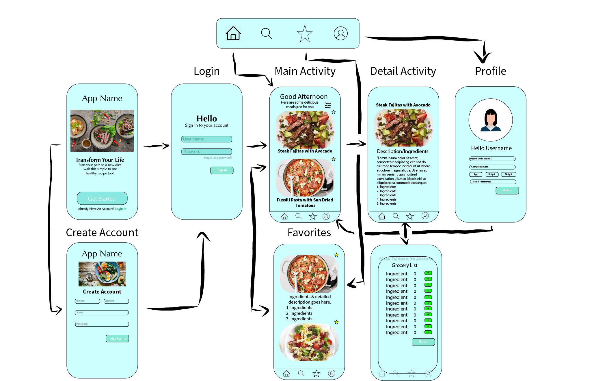

*HealthyBites*
Original App Design Project - README Template
===

# Nutrition

## Table of Contents
1. [Overview](#Overview)
1. [Product Spec](#Product-Spec)
1. [Wireframes](#Wireframes)
2. [Schema](#Schema)

## Overview
### Description
Our app will help our users by making it easier to become more informed on topics like nutrition and preparing meals that improves their well being.

### App Evaluation
- **Category:** Nutrition
- **Mobile:** For the time being, this application is mobile only.
- **Story:** Recipies, Favorites 
- **Market:** For health enthusiasts and people with dietary concerns
- **Habit:**  This app can be used on a daily basis
- **Scope:**  This app aims to become global! To facilitate people's ability to choose a variety of healthy foods and become more informed about their diet.

Category: Events.
Mobile: For the time being, this application is mobile only.
Story: Home feed, search for events, create event, profile view.
Market: This app are for any people looking to join, search, and create events in their local area.
Habit: This app can be used approximately 1-2 times a week or when you want to go to a new event.
Scope: This app aims to become global! Being able to search and find events from all around the world will open greater opportunities for the user!


## Product Spec

### 1. User Stories (Required and Optional)

**Required Must-have Stories**

* User can register for an account
* User can log in
* User can see different meals
* User can save meals into favorites


**Optional Nice-to-have Stories**
* User can create/edit profile
* Create/Edit favorite meals
* Get detailed view of each meals which inclides recipie and information
* Comparison option betweens meals
* Display portions of ingredients depending on the person
* Different meal uses Example:[weight-loss, muscle gain and more energy]
* Add/edit ingredients to grocery list button

### 2. Screen Archetypes

* Register
   * User can register for an account
* Login
   * User can log in
* Stream
  * User can see different meals 
* Creation
  * User can save meals into favorites  

### 3. Navigation

**Tab Navigation** (Tab to Screen)

* Home
* Favorites
* Profile

**Flow Navigation** (Screen to Screen)
* Login
  * Home
* Register
  * Home
* Home
  * Detail
    * Creation 

## Wireframes


## Schema 
### User
 | Property      | Type     | Description |
   | ------------- | -------- | ------------|
   | objectId      | String   | unique id for the user (default field) |
   | username      | String   | name of the user |
   | password      | String   | password for login |
   | email         | String   | email for account signup |
   | age           | Number   | age of user |
   | height        | Number   | height of the user |
   | weight        | Number   | weight of user |
   | createdAt     | DateTime | date when post is created (default field) |
   | updatedAt     | DateTime | date when post is last updated (default field) |
   
   
   ### Favorites
 | Property      | Type     | Description |
   | ------------- | -------- | ------------|
   | objectId      | String   | unique id for the user favorites list (default field) |
   | userId        | Pointer to User| favorites list owner |
   | nameRecipe    | String   | name of the saved recipe |
   | image         | File     | image of the saved recipe|
   | description   | String   | description of the recipe |
   | ingredients   | String   | list of recipe ingredients |
   | createdAt     | DateTime | date when post is created (default field) |
   | updatedAt     | DateTime | date when post is last updated (default field) |
   
   
   ### Grocery List
 | Property      | Type     | Description |
   | ------------- | -------- | ------------|
   | objectId      | String   | unique id for the user grocery list (default field) |
   | userId        | Pointer to User| grocery list owner |
   | ingredient    | String   | ingredient added by user |
   | quantity      | Number   | amount of ingredients |
   | createdAt     | DateTime | date when post is created (default field) |
   | updatedAt     | DateTime | date when post is last updated (default field) |
   
### Networking
#### List of network requests by screen
   - Home Feed Screen
      - (Read/GET) Query all posts where user is author
         ```swift
         let query = PFQuery(className:"Post")
         query.whereKey("author", equalTo: currentUser)
         query.order(byDescending: "createdAt")
         query.findObjectsInBackground { (posts: [PFObject]?, error: Error?) in
            if let error = error { 
               print(error.localizedDescription)
            } else if let posts = posts {
               print("Successfully retrieved \(posts.count) posts.")
           // TODO: Do something with posts...
            }
         }
         ```
      - (Create/POST) Create a new like on a post
      - (Delete) Delete existing like
      - (Create/POST) Create a new comment on a post
      - (Delete) Delete existing comment
   - Create Post Screen
      - (Create/POST) Create a new post object
   - Profile Screen
      - (Read/GET) Query logged in user object
      - (Update/PUT) Update user profile image
#### [OPTIONAL:] Existing API Endpoints
##### An API Of Ice And Fire
- Base URL - [http://www.anapioficeandfire.com/api](http://www.anapioficeandfire.com/api)

   HTTP Verb | Endpoint | Description
   ----------|----------|------------
    `GET`    | /characters | get all characters
    `GET`    | /characters/?name=name | return specific character by name
    `GET`    | /houses   | get all houses
    `GET`    | /houses/?name=name | return specific house by name

##### Game of Thrones API
- Base URL - [https://api.got.show/api](https://api.got.show/api)

   HTTP Verb | Endpoint | Description
   ----------|----------|------------
    `GET`    | /cities | gets all cities
    `GET`    | /cities/byId/:id | gets specific city by :id
    `GET`    | /continents | gets all continents
    `GET`    | /continents/byId/:id | gets specific continent by :id
    `GET`    | /regions | gets all regions
    `GET`    | /regions/byId/:id | gets specific region by :id
    `GET`    | /characters/paths/:name | gets a character's path with a given name
